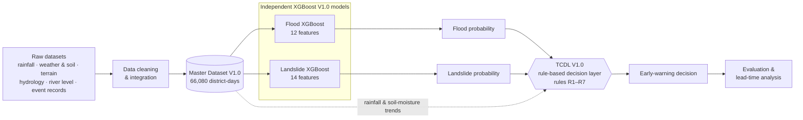

<p align="center">
  
</p>

<h1 align="center"><b>Kerala Flood–Landslide Early Warning System (V1.0)</b></h1>

<p align="center">
  Two independent XGBoost hazard models, coupled by a transparent rule-based Temporal Coupled Decision Layer
</p>

<p align="center">
  
  
  
  
  
</p>

---

## About the Project

Kerala experiences both floods and landslides during intense and prolonged rainfall. This capstone project studies whether **temporally coupling two independently predicted hazard probabilities** gives a different warning timing, detection or cost profile from treating each hazard on its own.

The system:

- **monitors flood and landslide risk** for **14 Kerala districts** on a daily, district-level grid (2012-01-30 to 2024-12-31);
- **predicts the two hazards independently** with two XGBoost V1.0 models;
- **combines their probability signals** through **TCDL V1.0**, a transparent rule layer (not a third model);
- provides **historical replay** of any day and **warning visualisation** in a React dashboard;
- exposes **model, evaluation, lead-time and SHAP information** through the dashboard and a FastAPI API.

> This is a research project. Its outputs are research results on historical data, not an operational disaster-warning service.

## Key Features

| Feature | Description |
|---|---|
| Two hazard models | Flood XGBoost V1.0 (12 features) and Landslide XGBoost V1.0 (14 features), trained on one chronological split |
| Rule-based coupling | TCDL V1.0: seven named rules (R1–R7) over smoothed probabilities and environmental trends, with training-period thresholds |
| Historical replay | Any day in the record can be replayed per district, from the stored V1.0 pipeline outputs |
| Warning timeline | Per-district warning history with the triggered rules behind every warning |
| Lead-time evaluation | 66 test-period hazard onsets, date-quantised lead times, comparison with single-hazard thresholds |
| Explainability | Exact TreeSHAP attributions for the real V1.0 models, global and per prediction |
| Real-model predictions | `POST /predict/flood` and `/predict/landslide` always score with the real V1.0 models |

## System Architecture



| Layer | Implementation |
|---|---|
| Data pipeline | `scripts/data/` (numbered scripts `01`–`13`) builds the master dataset |
| Hazard models | `scripts/models/flood_xgboost.py`, `scripts/models/landslide_xgboost.py` → `artifacts/models/`, `artifacts/results/` |
| Coupling layer | `scripts/models/tcdl_v1.py` → `artifacts/tcdl/` |
| Explainability | `scripts/analysis/shap_explainability.py` → `artifacts/shap/` |
| API | FastAPI (`backend/`), serves the stored V1.0 artifacts and scores new observations |
| Dashboard | React + Vite (`frontend/`), renders only what the API returns |

## Machine Learning Models

Two **independent** binary classifiers share one chronological split and one training recipe. Neither model sees the other hazard's label, and `date`, `district`, `latitude` and `longitude` are not model inputs.

| | Flood XGBoost V1.0 | Landslide XGBoost V1.0 |
|---|---|---|
| Features | 12 | 14 |
| Common environmental (9) | `rainfall_1d_mm`, `rainfall_3d_mm`, `rainfall_7d_mm`, `rainfall_14d_mm`, `rainfall_30d_mm`, `soil_moisture`, `temperature_c`, `humidity_percent`, `elevation_m` | same 9 |
| Hazard-specific | `river_level_m`, `distance_to_river_km`, `drainage_density` | `slope_degree`, `aspect_degree`, `curvature`, `land_cover`, `lithology` (last two native categorical) |
| Class weighting (`scale_pos_weight`, train only) | 15.7594 (43,496 / 2,760) | 461.56 (46,156 / 100) |
| Trees saved (best iteration + 1) | 9 | 38 |
| Decision threshold | 0.50 (fixed) | 0.50 (fixed) |

**Training configuration (both models):** `objective=binary:logistic`, `tree_method=hist`, `n_estimators=500`, `learning_rate=0.05`, `max_depth=5`, `min_child_weight=2`, `subsample=0.85`, `colsample_bytree=0.85`, `reg_lambda=1.0`, `eval_metric=aucpr`, early stopping after 50 rounds on the **validation** split, `random_state=42`. Missing `river_level_m` values are passed to XGBoost as missing (native handling) and are never imputed. Test labels are used only for evaluation.

**Chronological split** (on unique dates, no shuffling):

| Split | Dates | Rows | Flood positives | Landslide positives |
|---|---|---|---|---|
| Train | 2012-01-30 → 2021-02-14 | 46,256 | 2,760 | 100 |
| Validation | 2021-02-15 → 2023-01-23 | 9,912 | 242 | 22 |
| Test | 2023-01-24 → 2024-12-31 | 9,912 | 123 | 10 |

## Temporal Coupled Decision Layer (TCDL V1.0)

TCDL is **a rule layer, not a third machine-learning model**. It takes the two model probabilities and environmental trends and applies seven named, independently inspectable rules. It is rule-based so that every warning can be traced to the exact conditions that raised it; its only data-derived values are quantile thresholds from the **training period**.

**Temporal processing** (per district, trailing windows only, day *t* never uses later data):

- 3-day moving averages of the flood, landslide and coupled probabilities, rainfall and soil moisture;
- 3-day rates of change of the smoothed signals;
- coupled probability = noisy-OR `1 − (1 − P_flood)(1 − P_landslide)`, used as a ranking signal (it assumes independence and is not a calibrated joint probability).

**Rules** (thresholds are training-period quantiles):

| Rule | Condition |
|---|---|
| R1 flood level | `P_flood ≥ 0.50` (the flood model's own threshold) |
| R2 landslide level | `P_landslide ≥ 0.50` (the landslide model's own threshold) |
| R3 sustained joint | smoothed coupled ≥ 0.6888 (p90) on 2 consecutive days |
| R4 rising flood | smoothed flood ≥ 0.5160 (p75) **and** 3-day rise ≥ 0.0482 (p90) |
| R5 rising landslide | smoothed landslide ≥ 0.1315 (p75) **and** 3-day rise ≥ 0.0677 (p90) |
| R6 environmental precursor | smoothed coupled ≥ 0.5855 (p75) **and** rainfall rise ≥ 17.32 mm/day (p95) **and** soil-moisture rise ≥ 0.0233 (p90) |
| R7 joint moderate | smoothed flood ≥ 0.5360 (p80) **and** smoothed landslide ≥ 0.1615 (p80) |

**Warning generation:** a TCDL warning is raised on any district-day where **at least one of R1–R7 fires**. Each rule result is stored separately with the list of triggered rules, so every warning stays traceable. For display, the API labels a warning as Flood, Landslide or Coupled Hazard according to which rules fired; this labelling never changes whether a warning exists.

## Dataset

**Master Dataset V1.0**: `dataset/real_master_dataset.csv` — one row per district per day.

| Property | Value |
|---|---|
| Rows × columns | 66,080 × 23 |
| Districts × dates | 14 × 4,720 |
| Date range | 2012-01-30 → 2024-12-31 |
| Flood positives | 3,125 |
| Landslide positives | 132 |
| Missing values | `river_level_m` only (25,738 rows, 38.95 %); nothing imputed |
| SHA-256 | `832145448d3b96330f70a229b1fc94db16f3fdc8767ecc6aae4903c900f46c94` |

| Feature group | Columns | Source |
|---|---|---|
| Keys | `date`, `district`, `latitude`, `longitude` | district reference points (identifiers, not features) |
| Rainfall | `rainfall_1d_mm` and trailing 3/7/14/30-day sums | CHIRPS v2.0 district-mean daily rainfall |
| Weather & soil | `soil_moisture` (root-zone saturation fraction), `temperature_c`, `humidity_percent` | NASA POWER (MERRA-2) |
| Terrain | `elevation_m`, `slope_degree`, `aspect_degree`, `curvature` | DEM (AWS Terrarium z11), district means |
| Hydrology | `river_level_m`, `distance_to_river_km`, `drainage_density` | CWC river-level gauges; HydroRIVERS v1.0 |
| Land & geology | `land_cover`, `lithology` | ESA WorldCover 2021; CGWB aquifer map |
| Targets | `flood`, `landslide` | IMD-verified flood events (IFI-Impacts, IMD Disastrous Weather Events); exact-dated landslides (GSI inventory, IMD reports, plus 19 district-days added by manual source verification) |

Static terrain, hydrology and land/geology values take one value per district. A target of 0 means no dated record, not proven absence.

## Model Results

**XGBoost V1.0, held-out test split** (2023-01-24 → 2024-12-31, 9,912 district-days, threshold 0.50):

| Metric | Flood | Landslide |
|---|---|---|
| Test positives | 123 | 10 |
| ROC-AUC | 0.8657 | 0.9130 |
| PR-AUC | 0.0754 | 0.0165 |
| Precision | 0.0374 | 0.0132 |
| Recall | 0.8943 | 0.5000 |
| F1 | 0.0719 | 0.0256 |
| Confusion (TP / FP / TN / FN) | 110 / 2,828 / 6,961 / 13 | 5 / 375 / 9,527 / 5 |

PR-AUC should be read against the test base rates (1.24 % flood, 0.10 % landslide). The landslide figures rest on 10 test positives.

**TCDL V1.0 lead-time evaluation** (test period, 66 combined hazard onsets):

| System | Onsets detected | Median contiguous lead | District-days in warning | Warning days with no onset within 3 days |
|---|---|---|---|---|
| Flood threshold only (R1) | 65 / 66 | 8 days | 29.6 % | 93.1 % |
| Landslide threshold only (R2) | 24 / 66 | 0 days | 3.8 % | 91.6 % |
| **TCDL (R1–R7)** | **65 / 66** | **9 days** | **32.1 %** | **93.3 %** |
| Coupling rules only (R3–R7) | 61 / 66 | 0 days | 18.9 % | 93.4 % |

Lead times are **date-quantised**: the data has daily resolution, so a lead time is a whole number of days (an upper bound), not an hour-level timing. The *contiguous* lead is the unbroken run of warning days ending at the onset, within a 14-day look-back.

## Explainability / SHAP

SHAP values are computed with **exact TreeSHAP** (XGBoost `pred_contribs`, the routine `shap.TreeExplainer` uses for XGBoost) on the **real V1.0 models**, over the 9,912 test district-days. Values are in log-odds space, and the base value plus the SHAP values reconstructs each prediction.

| Rank | Flood (mean \|SHAP\| share) | Landslide (mean \|SHAP\| share) |
|---|---|---|
| 1 | `rainfall_14d_mm` (44.7 %) | `rainfall_3d_mm` (19.8 %) |
| 2 | `river_level_m` (15.5 %) | `humidity_percent` (16.4 %) |
| 3 | `soil_moisture` (8.6 %) | `rainfall_1d_mm` (14.6 %) |
| 4 | `rainfall_7d_mm` (7.6 %) | `rainfall_30d_mm` (13.6 %) |

The flood model relies mainly on medium-term (14-day) rainfall plus river level; the landslide model spreads attribution across short-term rainfall, humidity and 30-day rainfall. `land_cover` and `lithology` receive zero attribution because they are constant or nearly constant across districts. These are model associations, not causal effects. The API serves global importance (`/explain/global`) and per-prediction explanations (`/explain/current`).

## Project Structure

```text
.
├── backend/                 FastAPI service
│   ├── main.py              API routes
│   ├── config.py            artifact paths, model sets, CORS
│   ├── schemas.py           request/response models
│   ├── services/            model, TCDL, SHAP and district services
│   ├── data/                district reference points
│   ├── tests/               integration tests (real V1.0 pipeline)
│   └── tools/               offline-fixture recorder for the frontend
├── frontend/                React + Vite dashboard
├── dataset/                 real_master_dataset.csv (Master Dataset V1.0)
├── artifacts/               final V1.0 outputs
│   ├── models/              XGBoost boosters, feature contracts, metadata
│   ├── results/             metrics, test predictions, validation checks
│   ├── tcdl/                TCDL time series, warnings, lead time, thresholds
│   └── shap/                SHAP importance, explanations and plots
├── scripts/
│   ├── data/                data pipeline 01–13, label verification, report builders
│   ├── models/              XGBoost training and TCDL V1.0
│   ├── analysis/            SHAP and supplements (15, 16)
│   └── validation/          quality checks, training report, audits
├── pyproject.toml           runtime dependencies + Vercel entrypoint
├── requirements.txt         runtime dependencies (API)
├── requirements-research.txt  + scikit-learn, matplotlib, shap (offline scripts)
└── vercel.json              backend function file exclusions
```

These folders exist in the working copy but are **local-only** (listed in `.gitignore`, not in the repository):

| Folder | Purpose |
|---|---|
| `collected_datasets/` | raw and processed source data used to build the master dataset |
| `synthetic/` | synthetic reference dataset, models and outputs |
| `documents/` | reports, data dictionary, evaluation and provenance documents |
| `archive/` | pre-V1.0 models, SHAP and TCDL outputs kept for historical comparison |
| `bin/` | quarantine for files awaiting review |

## Installation & Local Setup

Requires **Python 3.13** and **Node.js with npm**.

```bash
git clone https://github.com/S1DHARTHK/coupled-flood-landslide-early-warning.git
cd coupled-flood-landslide-early-warning
```

Create and activate a virtual environment:

```bash
python -m venv .venv
```

```bash
source .venv/bin/activate        # macOS / Linux
```

```powershell
.venv\Scripts\activate           # Windows
```

Install the API dependencies and start the backend:

```bash
pip install -r requirements.txt
python -m uvicorn backend.main:app --host 127.0.0.1 --port 8000
```

In a second terminal, install and start the frontend:

```bash
cd frontend
npm install
npm run dev
```

The frontend reads the backend URL from `VITE_API_BASE_URL` and defaults to `http://127.0.0.1:8000`. To set it explicitly, create `frontend/.env.local`:

```bash
VITE_API_BASE_URL=http://127.0.0.1:8000
```

The training, SHAP and data scripts need extra packages:

```bash
pip install -r requirements-research.txt
```

## Running the Project

| Service | Local URL |
|---|---|
| Frontend dashboard | `http://localhost:5173` (Vite dev server) |
| Backend API | `http://127.0.0.1:8000` |
| Interactive API docs | `http://127.0.0.1:8000/docs` |

The dashboard calls the API first; if the API is unreachable it falls back to a recorded offline fixture (`frontend/src/data/devFixture.json`) and labels the source on screen.

On a fresh clone, `/health` reports `degraded` because the local-only synthetic reference set is absent; the real V1.0 endpoints are unaffected.

Run the backend integration tests from the repository root:

```bash
python backend/tests/test_real_integration.py
```

Rebuild the V1.0 outputs (these commands overwrite files in `artifacts/`):

```bash
python scripts/models/flood_xgboost.py
python scripts/models/landslide_xgboost.py
python scripts/models/tcdl_v1.py
python scripts/analysis/shap_explainability.py
```

## API Reference

Interactive documentation is available at `/docs` (OpenAPI schema at `/openapi.json`).

| Method | Path | Purpose | Key parameters / body |
|---|---|---|---|
| GET | `/` | API index | — |
| GET | `/health` | Liveness and readiness | — |
| GET | `/models/status` | Model, TCDL and artifact status | — |
| POST | `/predict/flood` | Flood probability and prediction from Flood XGBoost V1.0 | `{"observations": [ … ]}` — date, district or lat/lon, and the 12 flood features |
| POST | `/predict/landslide` | Landslide probability and prediction from Landslide XGBoost V1.0 | `{"observations": [ … ]}` — date, district or lat/lon, and the 14 landslide features |
| POST | `/predict/coupled` | TCDL warning for a supplied observation series | `{"observations": [ … ]}` — ordered daily series for one location |
| GET | `/current` | Conditions, predictions, trends and warning for one day | `location_id`, `as_of` |
| GET | `/trends` | Smoothed signals and rates used by TCDL | `location_id` (required), `start`, `end`, `split`, `limit` |
| GET | `/locations` | Locations available in the pipeline | — |
| GET | `/warnings` | Historical warning timeline | `location_id`, `start`, `end`, `split`, `warning_only`, `limit` |
| GET | `/warnings/{location_id}/{warning_date}` | Full warning detail with rule-level explanation | path parameters |
| GET | `/leadtime` | Per-event lead-time records | `system`, `hazard_type`, `location_id`, `detected_only`, `limit` |
| GET | `/evaluation` | TCDL V1.0 system comparison | `hazard_type` |
| GET | `/models/performance` | Stored evaluation metrics for both models | `model_set` |
| GET | `/models/features` | Feature contracts and stored importance | `model_set` |
| GET | `/districts` | The 14 districts of the master dataset | — |
| GET | `/districts/{district}/observation` | Real observed model inputs for one district and day | `date` |
| GET | `/explain/global` | Global mean \|SHAP\| importance | `model` |
| GET | `/explain/current` | SHAP explanation of a location's prediction | `location_id` (required), `model`, `mode`, `date` |

Prediction responses include `probability`, `prediction`, `warning_status`, `missing_features`, `model_set` (`real`), `model_version` (`1.0`), `decision_threshold` (`0.5`) and `model_artifact`. `GET /districts/{district}/observation` returns an observation in exactly the shape the prediction endpoints accept.

## Deployment

The frontend and backend are deployed as **two separate Vercel projects** from this repository.

| | Backend | Frontend |
|---|---|---|
| Root Directory | repository root | `frontend` |
| Framework | FastAPI (Python 3.13), entrypoint `backend.main:app` from `pyproject.toml` | Vite |
| Build | dependencies from `pyproject.toml` (on Linux, `xgboost-cpu`) | `npm run build` |
| Output | Python function; `vercel.json` excludes files the API does not read | `dist` |
| Environment | `CAPSTONE_CORS_ORIGINS=<frontend origin>` (optional `CAPSTONE_CORS_ORIGIN_REGEX`) | `VITE_API_BASE_URL=<backend URL>` (no trailing slash) |
| Other | the function is larger than the standard limit and uses Vercel Large Functions (`VERCEL_SUPPORT_LARGE_FUNCTIONS=1`) | `frontend/vercel.json` rewrites all routes to `index.html` for client-side routing |

| Deployment | URL |
|---|---|
| Frontend | `<frontend-url>` |
| Backend API | `<backend-url>` |

`VITE_API_BASE_URL` is applied at build time, so the frontend must be redeployed after it changes; `CAPSTONE_CORS_ORIGINS` likewise takes effect on the next backend deployment.

## Future Work

- Calibrate both models' probabilities on the validation split and choose warning thresholds.
- Decide how to treat the multi-week IMD summary-period flood labels, which the dataset keys file marks for a comparison run.
- Obtain the GSI Bhukosh landslide inventory and resolve the remaining 2012–2017 candidate records held for review, then rebuild the master dataset and retrain as a new version.
- Use finer land-cover and lithology data and a finer spatial unit than the district.

## Project Status / License

**Status:** V1.0 — the Master Dataset V1.0, both XGBoost V1.0 models, TCDL V1.0 and SHAP V1.0 are frozen, and the backend and frontend are deployed on Vercel.

**License:** no license is currently specified for this project. `frontend/LICENSE.md` is the MIT license of the TailAdmin React template the dashboard is built on.
